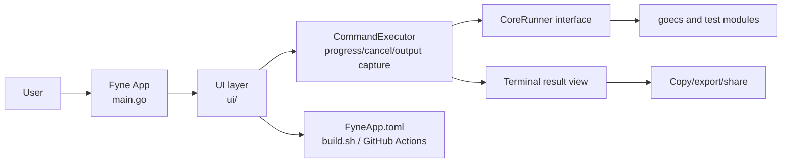

# GOECS GUI Version

[](https://github.com/oneclickvirt/ecs-gui/actions/workflows/build.yml)

[中文](README.md)

GOECS GUI is a Fyne-based cross-platform system benchmark and network testing app for Android, macOS, Windows, and Linux.

Upstream project: https://github.com/oneclickvirt/ecs

## Features

- Select basic info, CPU, memory, disk, streaming unlock, route, ping, and speed tests from the GUI
- Show real-time stage progress and the current running item
- Copy results, export a text file, or upload a share link
- Switch between Chinese/English UI and light/dark themes
- Send completion notifications on Android and request Windows UAC elevation when privileged tests need it

## Quick Start

1. Install Go 1.25.4 or newer.
2. Clone the repository and enter the `ecs-gui` directory.
3. Run `go mod download`.
4. Run `go run -ldflags="-checklinkname=0" .` for a development build.
5. Run `./build.sh desktop` when you need a local desktop artifact.

## Architecture



## Supported Platforms

### Android

- GitHub Actions build includes APK signing
- Minimum version: Android 7.0 (API Level 24)
- Recommended version: Android 13 (API Level 33) or newer
- Architectures: ARM64, x86_64

### macOS

- GitHub Actions build is unsigned by default
- Minimum version: macOS 11.0
- Architectures: Apple Silicon (ARM64), Intel (AMD64)
- Signing guide: [docs/macos-signing.en.md](docs/macos-signing.en.md)

### Windows

- GitHub Actions build is unsigned by default
- Minimum version: Windows 10
- Architectures: ARM64, AMD64
- Some disk and route tests require Administrator privileges; the GUI requests a UAC restart when needed

### Linux

- GitHub Actions build is unsigned by default
- Architectures: ARM64, AMD64

## Local Build

### Requirements

1. Go 1.25.4 or newer
2. Android SDK, only for Android builds
3. Android NDK 25.2.9519653, only for Android builds
4. JDK 17 or newer, only for Android builds

### Environment

```bash
export ANDROID_NDK_HOME=/path/to/android-ndk
go install fyne.io/tools/cmd/fyne@latest
```

### Commands

```bash
./build.sh desktop
./build.sh android
./build.sh macos
./build.sh windows
./build.sh linux
./build.sh all
```

Artifacts are written to the repository root.

Version sources:

- `VERSION` stores the app semantic version, for example `0.1.139`
- `FyneApp.toml` `Version` should stay in sync with `VERSION`
- GitHub Actions release tags use `vYYYYMMDD-HHMMSS`

### Environment Variables and CI Secrets

| Name | Location | Required | Purpose |
|------|----------|----------|---------|
| `ANDROID_NDK_HOME` | Local/CI | Android builds only | Points to Android NDK 25.2.9519653 |
| `FORCE_JAVASCRIPT_ACTIONS_TO_NODE24` | CI | Yes | Opts into the Node 24 Actions runtime |
| `GOPRIVATE` | CI | Private module builds | Allows downloading private modules such as `github.com/oneclickvirt/security` |
| `GHT` | GitHub Secret | CI | Accesses private Go modules and the signing keystore repository |
| `KEYSTORE_PASSWORD` | GitHub Secret | Android signing | APK keystore password |
| `KEY_PASSWORD` | GitHub Secret | Android signing | APK key alias password |
| `GITHUB_TOKEN` | GitHub-provided | CI | Creates releases and uploads artifacts |
| `APPLE_ID` / `APPLE_TEAM_ID` / `APPLE_APP_PASSWORD` | GitHub Secret | Optional macOS notarization | See the macOS signing guide |
| `MACOS_CERTIFICATE_P12` / `MACOS_CERTIFICATE_PASSWORD` | GitHub Secret | Optional macOS signing | See the macOS signing guide |

## Development

```bash
git clone https://github.com/oneclickvirt/ecs-gui.git
cd ecs-gui
go mod download
go run -ldflags="-checklinkname=0" .
```

## FAQ

- Why does development use `-ldflags="-checklinkname=0"`?
  An upstream dependency uses `linkname`; the current Go toolchain requires this check to be relaxed explicitly.
- Does this project use a database?
  No. The current app has no DB initialization, migrations, or connection pool logic.
- What is the share link limit?
  The GUI uploads the exported Markdown result to the share service, with a 25KB limit per upload.
- Why are macOS artifacts unsigned?
  GitHub Actions artifacts are unsigned by default. Configure certificates and notarization with [the macOS signing guide](docs/macos-signing.en.md) for production distribution.
